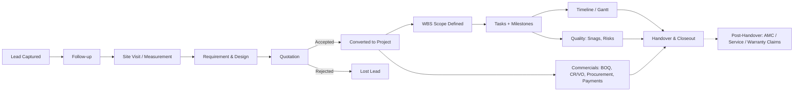

# Interior Module — Architecture & Workflow

A complete walkthrough of the Interior system: how it's built, and how a customer moves through it from first contact to project closeout.

---

## 1. Architecture Overview

### System Boundary
The Interior module is a **self-contained sub-system** inside the Sky-Lite web app. It does not share a backend, database, or authentication with the rest of Sky-Lite (the construction/CRM flow under `/projects`). It talks to its own dedicated service:

```
Frontend (Next.js, this repo)
   │
   ├── Sky-Lite core flow  ──────►  Sky-Lite backend (construction/CRM)
   │
   └── Interior flow ("interior-new")  ──────►  interior-os-backend (separate hosted API)
```

This separation was a deliberate porting decision — the Interior product started as its own app (`interior-os-frontend`) and was integrated into this codebase as an isolated module (`/interior-new/*` routes, `interiorApiClient`, `interiorCrmService`, `interiorProjectService`) rather than merged into the existing data model. Practically, this means:

- Interior leads, projects, tasks, etc. live in a different database than core Sky-Lite projects.
- Interior auth uses its own JWT access + refresh token pair, stored separately in the browser (`interiorAccessToken` / `interiorRefreshToken`), with automatic silent refresh on 401 responses.
- The two flows can evolve independently without risking regressions in the other.

### Frontend Structure
- **Framework**: Next.js App Router, TypeScript, Tailwind, Framer Motion for transitions.
- **Routing**: every screen lives under `/interior-new/...`. Project-specific pages live under `/interior-new/projects/[projectId]/...`, sharing one layout that renders the project banner + tab navigation, with each tab as its own route/page.
- **Data access**: a single `interiorProjectService` (and `interiorCrmService` for the sales side) wraps all API calls — one function per backend endpoint. Components call these services directly and manage their own loading/error state; there is no global client-side store.
- **Auth guarding**: every Interior page is wrapped by `useInteriorAuthGuard`, which checks the stored token before rendering.

---

## 2. The Business Lifecycle

The product models a real interior fit-out business end-to-end, in five phases:

```
CRM  →  Design  →  Execution  →  Handover  →  Post-Handover
```

Each phase is described below with what's actually built.

---

### Phase 1 — CRM (Lead → Won Project)

Everything before a contract is signed lives in the **CRM workspace**, organized as a pipeline of stages a lead physically moves through:

| Stage | What happens | Lead status |
|---|---|---|
| **Leads** | New enquiry captured (name, contact, property type) | `New Lead` |
| **Follow-ups** | Sales rep logs calls/contact attempts | `Contacted` |
| **Site Visits** | Physical measurement visit scheduled and logged | `Meeting Scheduled` → `Measurement Done` |
| **Requirement & Design** | Room-by-room requirements logged; design files (layouts/3D renders) uploaded and approved | `Requirement Completed` → `Design Approved` |
| **Quotations** | A quotation is built against the approved design/requirements and sent to the client; can go through negotiation | `Quotation Sent` → `Negotiation` → *Accepted* |
| **Won Projects** | Once a quotation is accepted, the lead is **converted** — this is the handoff point that creates a real Project record | `Converted` |

A parallel **Lost Leads** stage captures leads that drop out at any point, so the funnel is fully trackable.

> **Handoff mechanic**: "conversion" is a real action in the UI (`Convert to Project`) — it takes an accepted quotation and provisions a new Project entity, which is what everything in Phase 3 (Execution) operates on. This is the seam between "sales" and "delivery."

---

### Phase 2 — Design

Design isn't a separate module in the codebase — it's embedded inside the **Requirement & Design** CRM stage described above:
- Requirements are logged per lead (rooms, property details).
- Design files (layout drawings, 3D renders) are uploaded against the lead.
- A design must be marked **approved** before the lead can move to quotation.

This keeps design tightly coupled to the sales pipeline rather than a standalone execution phase — it's the step that turns "what the client wants" into "what we quote."

---

### Phase 3 — Execution

Once a project is converted, it lands in the **Project Workspace** (`/interior-new/projects/[id]`), organized into six tab groups:

**General**
- Overview dashboard (progress %, task stats, milestones, budget, open snags/RFIs/risks)
- File Management, Team & Members, Quotation reference

**Execution (the operational core)**
- **WBS Hierarchy**: Building → Floor → Zone → Area → **Package** (trade packages: Civil, MEP, Electrical, HVAC, etc.) — this defines *what physical/trade scope exists*
- **Tasks (Kanban)**: each task is tagged to a WBS package and optionally linked to a milestone — this is *the actual work*
- **Milestones**: checkpoints, each linking a set of tasks — this is *scheduling structure*
- **Timeline (Gantt)**: renders the full hierarchy as **WBS Package → Milestone → Task**, so you see scope, schedule, and execution in one view
- DPR Log, Weekly Reports, MOM — day-to-day site record-keeping

**Commercials (the money side, running parallel to execution)**
- BOQ Estimator (itemized costs, with its own approval lifecycle)
- Change Requests → Variation Orders (scope changes and their contract-value impact)
- Procurement → Purchase Orders → Vendors (the buying side)
- Payments (incoming from client, outgoing to vendors, debit notes)

**Quality & Safety**
- Snags Logger (defect/punch-list tracking)
- Risks Matrix

**Site Assets**
- CAD Drawings, RFIs Tracker, Site Details

**The throughline**: *WBS defines scope → Tasks execute against WBS packages → Milestones group tasks into checkpoints → Timeline visualizes the whole hierarchy → Commercials tracks the money against that same scope.*

---

### Phase 4 — Handover

A dedicated **Handover & Closeout** tab tracks the project's exit:
- A closeout **checklist** with completion tracking (shown as a progress ring)
- A **document registry** for operation manuals, warranty certificates, and other closeout paperwork
- Client sign-off recording

This is the last *built* phase in the system today.

---

### Phase 5 — Post-Handover

> collect docs to upload like: warrenty of electronics, material warrenty etc.

---

## 3. Summary Diagram


